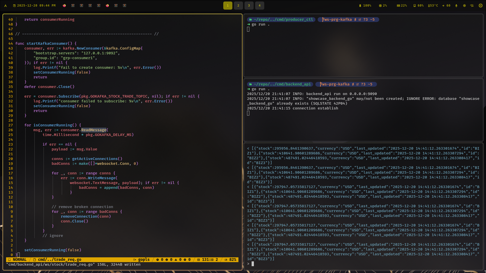

# showcase backend go

__*table of contents:*__

- [intro](#intro)
- [important](#important)

 

- [database](./docs/database/README.md)

 

[quick preview](https://youtu.be/TvGujQngAJ0)

go kafka websocket

 

## intro

a showcase backend using go, postgresql, & redis

__*prequiste:*__

- go: 1.25.0 or higher

 

- [__required packages__](./go.mod)

---

## important

__*before anything (build, run, test):*__

1. check on the this root project for config.json:
    - if doesn't exists, copy paste from config.json.template to config.json

2. check:
    - [backend_api listener](./config.json.template:4)
    - [postgresql main db](./config.json.template:11)
    - [redis main db](./config.json.template:21)

3. scripts:
    - [to build](./dbuild.sh)
    - [to debug use dlv](./ddebug.sh)
    - [to run the development](./drun.sh)
    - [to test *required to run the service/s first](./dtest.sh)

 

__*to run the test:*__

1. after all those 3 already checked
2. open a terminal, then you can run the service by run [`./drun.sh`](./drun.sh)
3. open another terminal session then run [`./dtest.sh`](./dtest.sh)

 

__*to check kafka result from websocket:*__

1. run your kafka instance
2. check [producer_ctl](./cmd/producer_ctl/main.go) and adjust your host ipaddrs:port
3. run the producer_ctl on seperate terminal session
4. run the backend_api on seperate terminal session
5. use websocket and open `/ws/stock/trade`, i.e.:
    - `wscat -c http://hostname:portnumber/ws/stock/trade`
6. consumer has no interaction, it always consume the data as long as it connect to the server

---

###### end of readme

